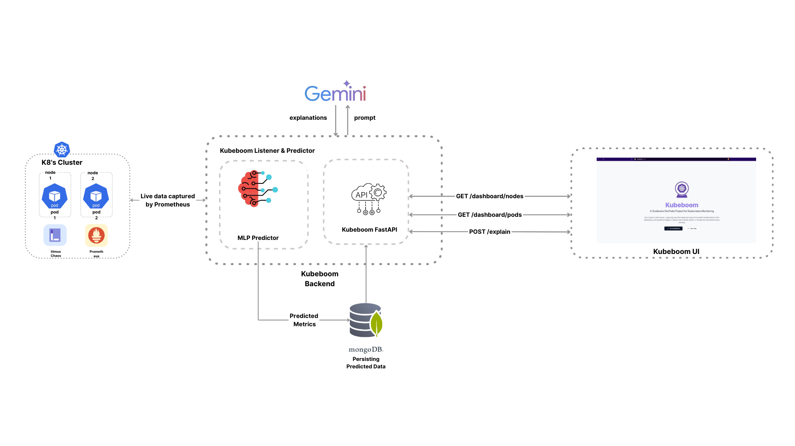

# **KubeBoom**  
> A Real-Time Kubernetes Health Prediction & Monitoring System  
> by **Team ClusterBusters**

<p>
  
</p>

**KubeBoom** is a real-time monitoring and predictive analytics tool for Kubernetes clusters. It leverages machine learning to detect pod health anomalies before they escalate into failures. The system integrates Prometheus for metrics collection, a live React-based dashboard for visualization, and a Generative AI backend that provides natural language explanations for any detected issues. Key features include live pod health classification, human-readable alert descriptions, and a dynamic, interactive dashboard for continuous cluster monitoring.


# Demo Video  
Check out the working demo of our project here:  
[](https://your-demo-video-link.com)

# Setup Instructions 
To run and manage the system in Phase II:

###  Clone the Repository
```bash
git clone https://github.com/CS-Amritha/DT.git
cd DT
```
###  Install Requirments.txt
```bash
pip install -r requirments.txt
```
###  Install Frontend Dependencies
```bash
cd frontend
npm install
cd ..
```
###  Running the Application
```bash
make up
```
###  Stop the Application
```bash
make down
```
###  Tear Down MongoDB Database 
```bash
make prune
```
###  Test the ML Models
```bash
make test-model
```
---
# Project Structure
```
Project Structure

├── dataset               # Contains the .csv data generated using our script
├── docs                  # Documentation.md
├── presentation          # Presentation Phase I
├── models                # Two models in .pkl format
├── src                   # Source code directory
│── test                  # Python and bash shell script to test the model
|── archive               # Past work (code, datasets, models)
|── litmus_chaos          # LitmusChaos YAMLs for chaos creation and admin config
|── frontend              # The frontend components 
|── flow_diagrams         # Contains flow diagrams for live data collection and data collection processes
└── README.md             # This file
```
# Data Collection Flow


# Live Capture Flow



# Phase II  
This phase includes live monitoring of Kubernetes clusters, predictive health classification of pods, dynamic UI visualization, and natural language explanations using GenAI for improved observability and decision-making.

#### Key Capabilities  
- Predict Kubernetes pod health (Good / Alert / Bad) using trained ML models on live Prometheus metrics  
- Display health status in real time on a modern, reactive dashboard  
- Integrate with a Large Language Model (LLM) to provide context-aware, human-readable explanations for unhealthy pods  

## System Architecture  
### Real-Time Metric Collection

We use **Prometheus** for scraping and querying real-time Kubernetes metrics:

- Built-in exporters like `kube-state-metrics` and `node-exporter` ensure efficient, out-of-the-box monitoring  
- Prometheus provides a rich query interface (PromQL) to extract relevant pod-level data used for predictions  

### Pod Health Prediction

Trained ML models receive Prometheus metrics and classify each pod as:

| Classification | Description                          |
|----------------|--------------------------------------|
| **Good**       | Stable and healthy pod               |
| **Alert**      | Under mild resource stress           |
| **Bad**        | Crashed or heavily stressed pod      |

Predictions are refreshed continuously, allowing users to catch issues as they evolve.

### Alert Storage with MongoDB

To store prediction results and alert history, we use **MongoDB**:

- Faster querying of flexible alert data compared to relational databases  
- Acts as a central store for both the UI dashboard and LLM context retrieval  
- Stores metadata like timestamps, affected pods, metrics at the time of alert  

### Live Dashboard

The UI dashboard visualizes real-time pod health using a responsive, performant frontend stack:

#### Built With

- **React + Vite + TypeScript**: Fast development with type safety  
- **Tailwind CSS**: Utility-first styling for rapid UI design  
- **shadcn-ui**: Clean, accessible UI components built on top of Radix  

#### Dashboard Features

- Real-time grid view of pod health status with color-coded indicators  
- Auto-refreshing display of alerts and metrics  
- Panel to drill into pod-specific metrics and historical anomalies  

### LLM Integration for Explanations

For better observability, a **GenAI-based explanation engine** interprets and explains alerts in plain English:

#### Tech Stack

- **google.generativeai (Gemini)**: Generates explanations based on metrics and logs  
- **FastAPI**: Lightweight backend serving prompt routes  
- **MongoDB**: Context store for alert data  
- **dotenv**, **Pydantic**, **Pathlib**, **Routers**, and **HTTPException** for scalable API design  

#### Why This Works

- Prometheus provides rich, live metrics  
- MongoDB is optimized for fast, schema-less alert queries  
- Gemini LLM enhances usability with natural language explanations  
- FastAPI ensures modular and scalable prompt handling  

### System Flow Overview

1. Prometheus scrapes metrics from the Kubernetes cluster  
2. Backend fetches and feeds data into ML models  
3. Predictions are stored in MongoDB  
4. Dashboard fetches updated health states and renders them live  
5. LLM retrieves context from MongoDB and generates natural language explanations  

### Phase II Outcomes

- Real-time, predictive Kubernetes monitoring  
- Dynamic visualization of pod health and alerts  
- Human-friendly explanations for improved DevOps response  
- Scalable and modular backend and frontend architecture  

# Phase I
Kubernetes clusters can encounter failures such as pod crashes, resource bottlenecks, and network issues. The
challenge in Phase 1 is to build an AI/ML model capable of predicting these issues before they occur by analysing
historical and real-time cluster metrics.

#### Key Challenges
- Node or pod failures
- Resource exhaustion (CPU, memory, disk)
- Network or connectivity issues
- Service disruptions based on logs and events

## Workflow Overview
### Namespace Segmentation

The Kubernetes cluster is logically divided into **namespaces** to:

- Create isolated test environments  
- Ensure clean and interference-free data collection

### Chaos Injection

Using **LitmusChaos**, we simulate realistic failure conditions to test pod resilience:

- Pod crashes  
- Resource exhaustion (CPU, memory)  
- Network delays and disruptions

These simulations replicate real-world stress environments, enabling our model to learn from diverse pod behaviors.

### Pod Classification

Each pod is categorized into one of the following classes based on its health status during chaos testing:

| Classification | Description                          |
|----------------|--------------------------------------|
| **Good**       | Stable and healthy pod               |
| **Alert**      | Under mild resource stress           |
| **Bad**        | Crashed or heavily stressed pod      |

### Metrics Collection & Labeling

We utilize **Prometheus** to collect **real-time pod-level metrics** during chaos tests, such as:

- CPU and memory usage  
- Network I/O  
- Pod restarts  
- Latency and availability

Each pod instance is labeled accordingly as **Good**, **Alert**, or **Bad** based on these metrics.

### Model Training

All collected metrics, along with their labels, are exported into **structured CSV files**. This forms the core dataset used to:

- Train ML models  
- Evaluate their accuracy and performance

---
## Progress Bar 

### Data Collection 
🟩🟩🟩🟩🟩🟩🟩🟩🟩⬜  90% 

### ML Model 
🟩🟩🟩🟩🟩🟩🟩🟩🟩⬜  90% 

### Live Data Tracking  
🟩🟩🟩🟩🟩🟩🟩🟩🟩⬜  90% 

## Tech Stack & Tools 🛠️

   <p>
  
  
  
  
  
  
  
  
  
  


  

  </p>


## Meet The Team 👥

<div align="center">
  <table>
    <tr>
      <td align="center">
        <a href="https://github.com/ADITHYA-NS">
          <br>
          @ADITHYA-NS
        </a>
      </td>
      <td align="center">
        <a href="https://github.com/Avi-Nair">
          <br>
          @Avi-Nair
        </a>
      </td>
      <td align="center">
        <a href="https://github.com/CS-Amritha">
          <br>
          @CS_Amritha
        </a>
      </td>
      <td align="center">
        <a href="https://github.com/Anaswara-Suresh">
          <br>
          @Anaswara-Suresh
        </a>
      </td>
      <td align="center">
        <a href="https://github.com/R-Sruthi">
          <br>
          @R-Sruthi
        </a>
      </td>
    </tr>
  </table>
</div>

